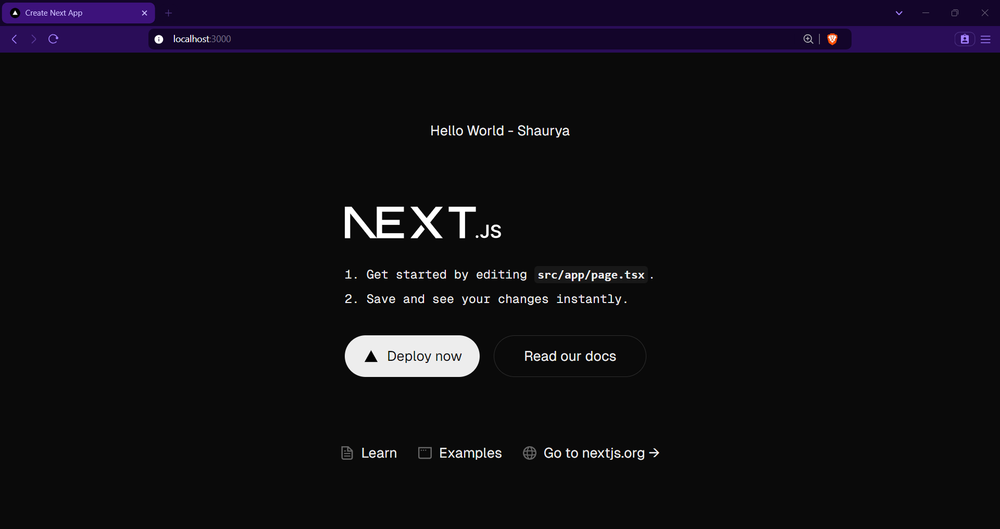

<h1>Next.js Practice Projects</h1>

- [1. Project 1 - Hello World](#1-project-1---hello-world)
- [2. Project 2 - Routing Demo](#2-project-2---routing-demo)

## 1. [Project 1 - Hello World](./hello-world/)

## 2. [Project 2 - Routing Demo](./hello-world/)

